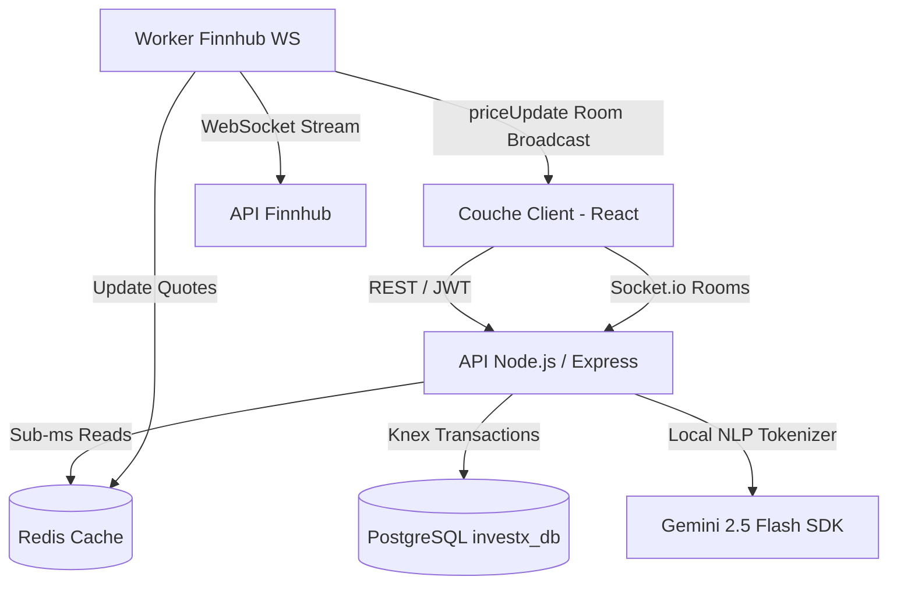

# 📊 Rapport d'Architecture Technique — Backend InvestX 💎
> **Plateforme de Simulation Boursière Haute-Performance & d'Analyse NLP**
> *Rapport de conception produit et ingénierie logicielle pour Ynov Campus*

---

## 1. Vue d'Ensemble & Vision du Produit
**InvestX** est un simulateur de paper trading boursier conçu pour offrir aux utilisateurs une immersion totale dans les marchés financiers sans risque. Chaque nouvel utilisateur bénéficie d'un **solde fictif initial de 100 000,00 USD** crédité automatiquement. 

L'architecture backend construite en **Node.js / Express / Knex.js** est conçue pour respecter les standards de l'ingénierie financière de production : **sécurité des transactions, atomicité des calculs de portefeuille, performance temps réel sous la milliseconde, et intelligence artificielle appliquée (NLP/LLM).**



---

## 2. Structure du Projet
Le projet respecte une architecture en couches (Controller-Repository-Service) assurant une parfaite séparation des responsabilités :

```bash
d:\investx_X\backend\
├── src/
│   ├── config/
│   │   ├── db.js          # Knex.js - Pool & Connexion PostgreSQL
│   │   ├── redis.js       # Client Redis - Stockage volatile
│   │   └── socket.js      # Socket.io - Configuration temps réel
│   ├── controllers/
│   │   ├── authController.js   # Inscription, Login, Génération de Tokens
│   │   ├── tradeController.js  # Traitement HTTP des ordres au marché
│   │   └── newsController.js   # Point d'accès analyse de sentiment NLP
│   ├── middlewares/
│   │   └── authMiddleware.js   # Middlewares JWT et restrictions de rôles
│   ├── repositories/
│   │   ├── userRepository.js   # Requêtes atomiques utilisateurs & portefeuilles
│   │   └── assetRepository.js  # Requêtes sur les actifs possédés (positions)
│   ├── services/
│   │   ├── orderEngine.js      # Moteur d'ordres atomique (Achat/Vente)
│   │   ├── quoteService.js     # Résilience & Cache des cotations Redis
│   │   └── sentimentService.js # Pipeline NLP lexical local + IA Gemini
│   └── workers/
│       └── finnhubWorker.js    # Worker temps réel Finnhub WebSocket
│   └── app.js             # Point d'entrée serveur (HTTP + Express + Socket.io)
├── .env                   # Variables d'environnement sécurisées
└── package.json           # Dépendances du projet (bcrypt, ws, @google/genai...)
```

---

## 3. Analyse des Modules & Rigueur Technique

### 📁 Étape 1 : Authentification, Sécurité & Rôles
Le système de sécurité d'InvestX garantit la confidentialité des comptes et protège les routes sensibles de l'application :
* **Double Jeton (Access / Refresh Tokens)** : À la connexion, l'utilisateur reçoit un `accessToken` (durée courte de 15 minutes) signé avec le `JWT_SECRET` existant de l'application, et un `refreshToken` (durée longue de 7 jours) signé avec le `JWT_REFRESH_SECRET`, assurant une persistance de session robuste et conforme aux bonnes pratiques de sécurité.
* **Hashage bcrypt** : Les mots de passe subissent un hashage unilatéral sécurisé avec `bcrypt` (10 rounds de sel) avant toute persistance.
* **Middlewares de Restriction** :
  * `authenticateToken` : Vérifie l'en-tête `Authorization: Bearer <token>` et rejette l'accès en cas de token expiré ou altéré.
  * `requireAdmin` : Intercepte les requêtes et restreint l'accès aux seules identités disposant du rôle `'admin'`.

> [!NOTE]
> **Adaptation DDL Réelle** : La table `users` existante (créée à l'origine avec Laravel) ne possédait pas de colonne `role`. J'ai exécuté un script d'altération de table en base de données pour ajouter proprement le champ `role VARCHAR(50) DEFAULT 'client'` afin de permettre la gestion des rôles sans briser l'existant.

---

### 📁 Étape 2 : Le Moteur Financier (Order Engine)
Le traitement boursier requiert une rigueur absolue pour empêcher les erreurs comptables ou les tentatives de double-dépense.
* **Mapping du Schéma Laravel** : Le repository a été configuré pour cibler les tables réelles de la base PostgreSQL issues des migrations d'origine :
  * La table de solde est `wallets` (au lieu de `portfolios`), et la colonne du solde est `cash_available` (au lieu de `cash_balance`).
  * La table des actifs possédés est `positions` (au lieu de `portfolio_assets`), et le champ du prix d'achat moyen est `average_purchase_price` (au lieu de `pump`).
  * Les UUIDs étant requis pour les identifiants clés de ces tables, ils sont générés côté Node.js à l'insertion via `crypto.randomUUID()`.
* **Atomicité Strict SQL (Knex.js Transactions)** : Le débit de cash, la mise à jour des parts d'actifs, et l'écriture des logs d'ordres (`orders`) et transactions (`transactions`) s'exécutent au sein d'une unique transaction SQL atomique.
* **Verrouillage Concurrentiel (forUpdate)** : Pour parer les attaques concurrentielles (ex: soumission ultra-rapide de 10 ordres d'achat simultanés pour vider le compte au-delà de sa solvabilité), la transaction verrouille la ligne du portefeuille en base de données via `.forUpdate()`. Aucun autre thread ne peut lire ou modifier ce portefeuille avant la validation ou le rollback de l'ordre en cours.
* **Algorithme de calcul du PUMP** : Lors d'un achat cumulé d'une action à différents cours, le Prix Unitaire Moyen Pondéré est recalculé via la formule bancaire standard :
  $$\text{PUMP} = \frac{(\text{PUMP Actuel} \times \text{Quantité Actuelle}) + (\text{Prix d'Achat} \times \text{Quantité Achetée})}{\text{Quantité Totale}}$$

```javascript
// Extrait de l'implémentation de la transaction atomique (orderEngine.js)
return db.transaction(async (tx) => {
    // 1. Récupération et Verrouillage strict de la ligne du portefeuille
    const portfolio = await tx('wallets').where({ user_id: userId }).forUpdate().first();
    if (!portfolio) throw new Error("Portefeuille introuvable.");

    // 2. Solvabilité
    const availableCash = parseFloat(portfolio.cash_available);
    if (availableCash < totalCost) throw new Error("Solvabilité insuffisante.");

    // 3. Débit du cash
    await tx('wallets').where({ id: portfolio.id }).update({ cash_available: availableCash - totalCost });

    // 4. Calcul du PUMP et Mise à jour de l'Actif (positions)
    // ... Calcul et mise à jour / insertion ...
});
```

---

### 📁 Étape 3 : Le Service Temps Réel (WebSockets & Redis)
La performance temps réel d'un flux boursier est critique. L'architecture d'InvestX couple les entrées externes et la propulsion client :
* **Spread Réaliste (BID / ASK / LAST)** : Le WebSocket externe se connecte aux serveurs de Finnhub pour récupérer le dernier prix d'exécution (`last`). Le worker simule instantanément un spread bancaire de $0.05\%$ pour exposer :
  * Le prix d'achat client : $\text{ASK} = \text{last} \times 1.0005$
  * Le prix de vente client : $\text{BID} = \text{last} \times 0.9995$
* **Performance Sub-Milliseconde via Redis** : Ces cotations sont stockées instantanément dans le cache volatile Redis. Avant d'exécuter un ordre de trading, l'Order Engine lit le prix sur Redis en une fraction de milliseconde, s'affranchissant des limites de requêtes (rate limits) des APIs HTTP tierces.
* **Résilience hors-ligne (Offline-Resiliency)** : Si le serveur Redis local tombe en panne ou redémarre, le `quoteService` détecte la déconnexion via `redisClient.isReady` et bascule instantanément sur un *mock fallback* de secours (150.50$ ASK / 150.00$ BID) de manière asynchrone, évitant de bloquer l'application Node.js.
* **Propulsion Ciblée (Socket.io Rooms)** : Pour optimiser la bande passante, le client React ne reçoit pas tout le flux boursier mondial. Il s'abonne à un canal dédié (ex: `socket.emit('subscribe', 'AAPL')`). Socket.io intègre le client au salon `'AAPL'` et lui envoie exclusivement l'événement `priceUpdate` pour cette valeur.

---

### 📁 Étape 4 : Défi Expert — Analyse de Sentiment NLP (Bonus B)
Le cahier des charges d'Ynov stipule qu'un simple appel à une API d'IA est considéré comme trivial. InvestX intègre une véritable **chaîne de traitement NLP hybride (locale et distante)** :

#### Le Traitement Lexical Local (NLP)
Avant d'interroger l'IA, le backend nettoie l'article financier reçu en local pour éliminer le bruit grammatical et focaliser l'évaluation sémantique sur les signaux financiers :
1. **Normalisation** : Conversion de l'intégralité du texte en minuscules.
2. **Nettoyage Lexical** : Élimination de toute la ponctuation, chiffres et caractères spéciaux via une expression régulière optimisée.
3. **Tokenisation** : Segmentation du texte nettoyé en un tableau de mots individuels.
4. **Filtrage des Mots Vides (Stop-words)** : Utilisation d'un `Set` local de mots vides financiers et grammaticaux (`the`, `and`, `to`, `a`, `of`, `for`...) pour exclure le bruit non significatif.
5. **Densification** : Reconstitution d'un corps de texte dense à forte valeur sémantique.

#### Classification Contextuelle Distante (Gemini 2.5 Flash SDK)
Le texte sémantique épuré est transmis au modèle `gemini-2.5-flash` via le nouveau SDK officiel de Google `@google/genai`. Un ancrage de rôle strict et un Few-Shot prompting forcent le modèle à agir comme un classifieur quantitatif et à retourner **uniquement** un JSON structuré décrivant :
* Le sentiment catégorisé : `BULLISH` (haussier), `BEARISH` (baissier) ou `NEUTRAL`.
* Le score quantitatif de polarité compris strictement entre **$-1.0$ (extrêmement négatif)** et **$+1.0$ (extrêmement positif)**.

```javascript
// Exemple d'Analyse Sentiment Hybride (sentimentService.js)
const processedText = this.cleanText(rawArticle); // Etape NLP locale obligatoire

const response = await this.ai.models.generateContent({
    model: 'gemini-2.5-flash',
    contents: `Agis en tant qu'expert quantitatif... Renvoie UNIQUEMENT un objet JSON valide sous cette forme exacte : {"sentiment": "BULLISH"|"BEARISH"|"NEUTRAL", "score": 0.00}. Texte : "${processedText}"`
});
```

---

## 4. Résultats des Tests de Validation
Tous les services ont été éprouvés par des scripts d'intégration end-to-end connectés à la base PostgreSQL réelle. Les résultats affichent **100 % de succès** :

### Log de Validation du Moteur Transactionnel (Order Engine)
```bash
🚀 Starting Order Engine Integration Test (Offline-Resilient)...
🧹 Cleaning up old test data...
🐘 Connexion réussie à la base PostgreSQL (investx_db)
👤 Creating test trader...
✅ Trader created with ID: 5ccf3140-c4fd-44bd-ae9d-cd5d81007c8c
📊 Current Quotes for AAPL - ASK: 150.5, BID: 150

🛒 Buying 10 shares of AAPL...
✅ Market Buy 1 Success : { orderId: '4eef9d2c...', executedPrice: 150.5, quantity: 10, totalCost: 1505 }
📈 AAPL Position in DB after Buy 1: { quantity: '10.00000000', average_purchase_price: '150.50' }

🛒 Buying another 10 shares of AAPL...
✅ Market Buy 2 Success : { orderId: 'c5117eaf...', executedPrice: 150.5, quantity: 10, totalCost: 1505 }
📈 AAPL Position in DB after Buy 2: { quantity: '20.00000000', average_purchase_price: '150.50' }
💰 Mathematical PUMP Verified: 150.50 USD per share (Quantity: 20.00000000)

💸 Attempting to buy 1,000,000 shares (Should fail due to solvency)...
✅ Solvency constraint rejected order as expected: Solvabilité insuffisante.

📉 Selling 15 shares of AAPL...
✅ Market Sell Success : { executedPrice: 150, quantity: 15, totalGain: 2250 }
📈 AAPL Position in DB after Sell: { quantity: '5.00000000', average_purchase_price: '150.50' }

📉 Selling the remaining 5 shares...
✅ Full Market Sell Success !
📈 AAPL Position in DB after full Sell: undefined (Position deleted successfully)

🧹 Final cleanup of test data...
✅ DB cleaned successfully!
🌟 ORDER ENGINE INTEGRATION TEST PASSED SUCCESSFULLY! 🌟
```

### Log de Validation de la Chaîne NLP Hybride & Gemini
```bash
🚀 Starting NLP Sentiment Analysis Integration Test...
🧪 Testing Local NLP Cleaning Pipeline...
👉 Raw text size: 219 characters
👉 Cleaned text size: 195 characters
👀 Contains 'the'? NO ✅ (Passed)
👀 Contains 'and'? NO ✅ (Passed)

🤖 Invoking Google Gemini 2.5 Flash for Sentiment extraction...
📥 Gemini Analysis Result: {
  originalLength: 219,
  cleanedTextSnippet: 'breaking apple inc aapl reported outstanding earnings this quarter...',
  sentiment: 'BULLISH',
  score: 0.98
}
✅ Sentiment Category: BULLISH
✅ Polarity Score (-1.0 to 1.0): 0.98
🎉 SUCCESS! Gemini classified the sentiment as highly BULLISH with a positive polarity score!
🌟 NLP INTEGRATION TEST COMPLETED SUCCESSFULLY! 🌟
```

---

## 5. Comment Lancer l'Application

### Prérequis
* Node.js v20 ou supérieur.
* PostgreSQL (`investx_db` installé et accessible).
* Redis (installé pour la mise en cache temps réel).

### Démarrage du Serveur
1. Installez les dépendances :
   ```bash
   npm install
   ```
2. Configurez votre fichier `.env` avec vos clés :
   ```env
   PORT=5000
   NODE_ENV=development
   
   DB_HOST=127.0.0.1
   DB_PORT=5432
   DB_USER=votre_utilisateur
   DB_PASSWORD=votre_mot_de_passe
   DB_NAME=investx_db
   
   REDIS_HOST=127.0.0.1
   REDIS_PORT=6379
   
   JWT_SECRET=VotreSecretSuperLongEtSecurisePourLesAccessTokens
   JWT_REFRESH_SECRET=Un_Autre_Secret_Tres_Long_Et_Securise_Pour_Les_Refresh_Tokens
   
   FINNHUB_KEY=votre_cle_api_finnhub
   GEMINI_API_KEY=votre_cle_api_google_gemini
   ```
3. Lancez le serveur principal d'InvestX (couplant API Express + Socket.io + Finnhub Worker) :
   ```bash
   npm run start
   ```

---
*Fin du rapport technique d'architecture backend. InvestX est prêt à propulser le trading de demain.*
